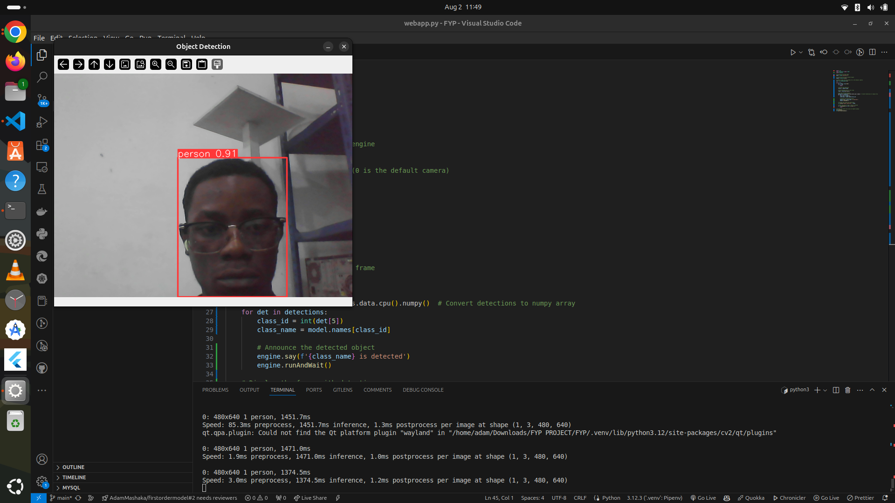

# Project Name: Blind Assistor stick

## Project Description
Blind stick is the FYP project that deal with connecting of Robotics and AI/ML that will help blind man to know what it is ahead of him or she.

**Team Members:**
- Adam .M. Katani
- Github: @AdamMAshaka 
-Email: mashakaadam123@gmail.com

-Ramadan Kidola
-Github: @dollatron
-Email:     

-Engineer Brian
-Github:
-Email: 

kind of flow chart we will use is 





## Technologies Used

- Python for intergration of Web camera and Object.
- pytorch: For clear of object seen.
- pyttsx 
- yolov9 


```sh
   pip install opencv-python opencv-python-headless

```

```sh
wget https://raw.githubusercontent.com/chuanqi305/MobileNet-SSD/deploy.prototxt
wget https://github.com/chuanqi305/MobileNet-SSD/raw/master/mobilenet_iter_73000.caffemodel
   
```   


## How It Works

1. User open the application
2. User run the server
3. User show the object
4. Adam will tell you what it is.

## Showcase Video

[Watch the Showcase Video](https://Github.com/AdamMashaka)

## Submission Details

**Repository:** [GitHub Repository](https://github.com/AdamMashaka/bliind_DIT)
**Demo:** [Live Demo](https://)

# You wanna fork it? 
  just fork it and push you are changes in my origin directory  

  ```sh
     git fetch origin
     git merge origin/main
     # Resolve any merge conflicts if necessary
     git add <resolved-file>  # Only if there were conflicts
     git commit -m "Resolve merge conflicts"  # Only if there were conflicts
     git push origin main

```


## How you are pi should lopojk like

```
#!/bin/sh -e
#
# rc.local
#
# This script is executed at the end of each multiuser runlevel.
# Make sure that the script will "exit 0" on success or any other
# value on error.
#
# In order to enable or disable this script just change the execution
# bits.
#
# By default this script does nothing.

# Print the IP address
_IP=$(hostname -I) || true
if [ "$_IP" ]; then
  printf "My IP address is %s\n" "$_IP"
fi

python3 /home/pi/Downloads/object_detection/tensor.py &

exit 0


```

## Do not forget to give it a star

##  GIVE CREDIT TO ADAM KATANI
